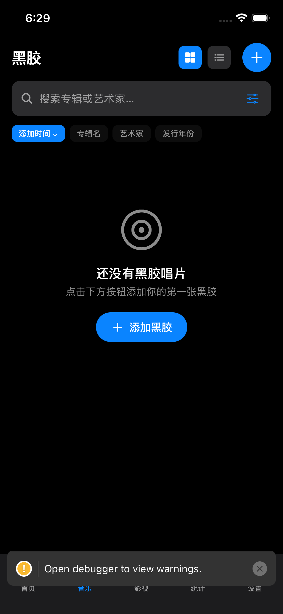
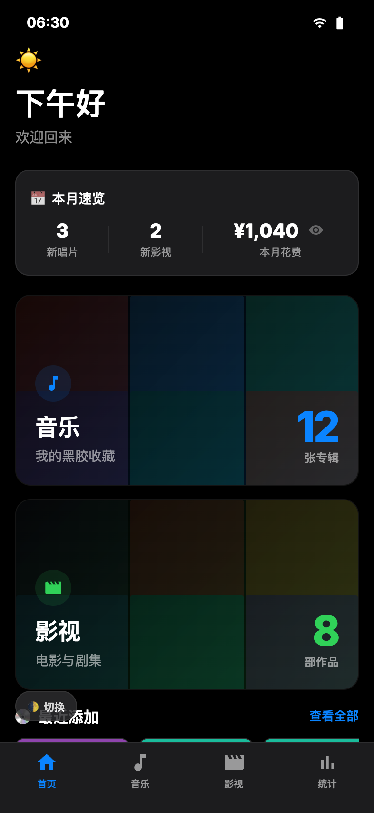

# MediaVault

<p align="center">
  
</p>

<p align="center">
  
  
  
</p>

一个精美的个人多媒体收藏管理应用，用于追踪和管理您的黑胶唱片与影视收藏。支持条码扫描、API 搜索、飞书云同步等功能。

---

## 📱 界面预览

<p align="center">
  
  
  
</p>

---

## ✨ 功能特色

### 🎵 黑胶唱片管理
- **条码扫描** — 扫描唱片条码自动识别
- **Discogs API** — 搜索并获取唱片详细信息
- **自定义标签** — 添加个人标签分类
- **购买记录** — 记录购买日期和价格

### 🎬 影视收藏管理
- **TMDB API** — 搜索电影和电视剧，支持中文
- **中英双语** — 英文主标题 + 中文副标题
- **剧集追踪** — 按季管理电视剧进度
- **观看状态** — 已看 / 想看 / 在看

### 📊 数据统计
- **收藏概览** — 总数、本月新增、总花费
- **月度趋势** — 堆叠柱状图（电影蓝 + 剧集橙）
- **艺术家排行** — 最爱的音乐人 TOP 10
- **类型分布** — 电影 / 电视剧分类统计
- **发行年份** — 按年份降序排列，一目了然

### 🎨 视图模式
- **网格视图** — 2列卡片，显示封面、标题、元数据
- **列表视图** — 紧凑列表，快速浏览
- **海报视图** — 4列纯海报墙，沉浸式浏览

### ☁️ 数据同步
- **飞书多维表格** — 云端备份，多设备查看
- **本地 SQLite** — 离线可用，响应迅速

---

## 🛠️ 技术栈

| 类别 | 技术 |
|------|------|
| 框架 | React Native + Expo SDK 54 |
| 本地数据库 | SQLite |
| 云同步 | 飞书多维表格 API |
| 音乐 API | Discogs |
| 影视 API | TMDB（免费 400k/月，支持中文） |
| 动画 | React Native Reanimated |
| 导航 | React Navigation |

---

## 🚀 快速开始

### 1. 环境准备
```bash
# 安装依赖
npm install

# iOS 首次构建
npx expo run:ios
```

### 2. 环境变量
创建 `.env` 文件：
```env
EXPO_PUBLIC_DISCOGS_TOKEN=your_discogs_token
EXPO_PUBLIC_TMDB_API_KEY=your_tmdb_api_key
```

### 3. 飞书同步（可选）
在设置页面填入飞书多维表格的 App ID、App Secret 及表格 URL，即可启用云同步。

---

## 📂 项目结构

```
MediaVault/
├── src/
│   ├── components/        # 可复用组件
│   │   ├── VinylDetailModal.tsx
│   │   ├── MovieDetailModal.tsx
│   │   ├── ArtistDetailModal.tsx
│   │   ├── StarRating.tsx
│   │   └── ...
│   ├── screens/           # 页面
│   │   ├── HomeScreen.tsx
│   │   ├── VinylScreen.tsx
│   │   ├── MovieScreen.tsx
│   │   ├── StatsScreen.tsx
│   │   └── SettingsScreen.tsx
│   ├── database/          # SQLite 操作
│   │   └── database.ts
│   ├── services/          # API 服务
│   │   ├── discogs.ts
│   │   ├── tmdb.ts
│   │   └── feishuSync.ts
│   └── theme.ts           # 主题配置
├── App.tsx                # 应用入口
├── preview.html           # UI 预览
└── package.json
```

---

## 🔧 API 获取

### Discogs API
1. 访问 [Discogs Developer Settings](https://www.discogs.com/settings/developers)
2. 创建应用获取 Personal Access Token

### TMDB API
1. 访问 [TMDB API Settings](https://www.themoviedb.org/settings/api)
2. 申请 API Key（免费 400,000 次/月，支持中文数据）

---

## 📋 开发路线图

- [x] 黑胶唱片 CRUD + 条码扫描
- [x] 电影 / 电视剧 CRUD
- [x] 统计分析（堆叠柱状图、TOP 10）
- [x] 网格 / 列表 / 海报视图切换
- [x] 飞书多维表格云同步
- [x] 日间 / 深色模式
- [x] 发行日期排序
- [x] 竞品分析报告
- [ ] 用户账号系统
- [ ] 评分与评论
- [ ] 数据导入 / 导出
- [ ] 社交分享
- [ ] iPad 适配

---

<p align="center">
  Made with ❤️ by <a href="https://github.com/Ziweili-12">Ziweili</a>
</p>
